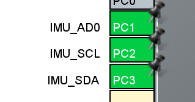

## 目录

```
ChipDoc ------ 芯片技术手册
ExamplePj ---- STM32示例工程（基于FreeRTOS）
IMU ---------- ICM20948相关头文件
```

## 工程配置

软件模拟I2C，标准的I2C引脚工作模式配置。可参考 [第十章 I2C - 小李 的知识库](https://tonmoon.top/study/STM32/10.I2C通信/#1014-i2c)



## 特殊说明

关于软件I2C的延时，有一个微秒级延时函数在文件中，但使用会导致程序出问题，具体原因暂未找出，故建议使用官方毫秒级延时函数。裸机可以用`HAL_Delay`，FreeRTOS则使用`vTaskDelay`。

其他程序则无需修改即可直接移植到裸机中使用。

ICM20948相关介绍：[ICM20948 - 小李 的知识库](https://tonmoon.top/study/芯片系列/ICM20948/)